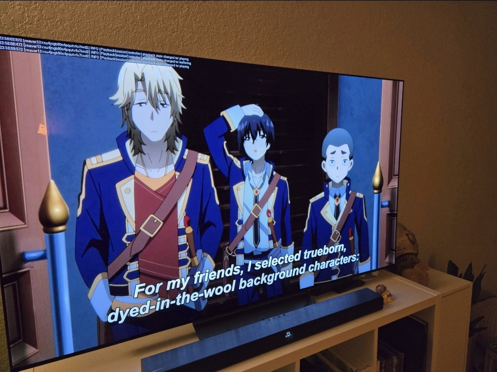

# plex-http-proxy

A Rust HTTP proxy that temporarily fixes Plex transcoding on LG webOS TVs.



## What Happened

LG or plex pushed an update that broke all my subtitled weaboo shit. Doesn't stream, throws MEDIA_ELEMENT_ERROR. Annoying. Unncessary.

### Bug #1: TLS is cooked? Maybe?

[This guy](https://forums.plex.tv/t/lg-webos-unexpected-playback-error-when-transcoding/936165/16) said some stuff about it being broken for TLS, so i was like "well, why don't we just use http instead?". I tried that and it still wanted https - so I ended up just figuring out what DOES work. 

When I intercepted the server, I found that it worked with direct_play but broke with subs. Since i cant speak Japanese - this is a problem.

### The Result

Any content that requires transcoding - which includes anything with subtitles - crashes immediately. Direct play works intermittently at best. Plex's server-side XML profiles are useless because the transcode engine cheerfully ignores custom profile configurations. I tried like 15 of them. 

## What This Questionable Package Does

This is a Rust HTTP proxy that sits between your LG TV and Plex Media Server. It:

1. **Listens on port 32400** (the standard Plex port) so the TV talks to it like a normal Plex server
2. **Terminates TLS** -- the proxy speaks plain HTTP to the TV and HTTPS to Plex, working around the broken TLS stack (Bug #1 - probably)
3. **Intercepts transcode requests** and runs `ffmpeg` with NVENC (NVIDIA hardware encoding) instead of using Plex's built-in transcoder, producing HLS segments that the webOS Chrome engine can actually play (Bug #2 - probably)
4. **Proxies everything else** straight through to Plex unchanged -- library browsing, metadata, artwork, direct play, all of it

Essentially, it's a full replacement for Plex's transcode pipeline that actually works on post-update LG TVs.

### Bonus: Free Hardware Transcoding

Plex gates hardware transcoding behind Plex Pass. That's really stupid. This uses ffmpeg & nvenc, so that's nice.

## Requirements

- **Rust toolchain** -- install from [rustup.rs](https://rustup.rs/)
- **ffmpeg** with **libass** (subtitle rendering) and **NVENC** support -- [gyan.dev builds](https://www.gyan.dev/ffmpeg/builds/) work great on Windows (but I used choco)
- **NVIDIA GPU** -- any Maxwell or newer (GTX 900 series+) for NVENC
- **Plex Media Server** installed and configured

## Setup

### Proxy

```
LG TV (port 32400) --> [plex-http-proxy] --> Plex Media Server (port 32401)
                        plain HTTP            HTTPS (self-signed)
```

The proxy must be on port 32400. The TV hardcodes segment fetch URLs to whatever port the server advertises, so the proxy needs to be the thing on the advertised port. There's no way around this.

### Steps

1. **Build the proxy:**
   ```
   cargo build --release
   ```

2. **Stop Plex Media Server**

3. **Start the proxy** (it grabs port 32400):
   ```
   ./target/release/plex-http-proxy
   ```

4. **Start Plex Media Server**

5. **That's it.** The TV connects to the proxy on 32400 and gets picked up by our proxy. 


### WINDOWS PEOPLE
On Windows, you can use the included `start.bat` which automates steps 2-4. EZ PZ. Tested it on several shows and they worked.

### Configuration

All settings have sensible defaults but can be overridden via environment variables or CLI arguments (CLI takes precedence):

| Setting | CLI Flag | Env Var | Default |
|---------|----------|---------|---------|
| Listen port | `--port 32400` | `PLEX_PROXY_PORT` | `32400` |
| Plex backend URL | `--backend https://127.0.0.1:32401` | `PLEX_BACKEND` | `https://127.0.0.1:32401` |
| Transcode output dir | `--transcode-dir /path/to/dir` | `PLEX_TRANSCODE_DIR` | Platform default* |
| ffmpeg binary | `--ffmpeg /path/to/ffmpeg` | `PLEX_FFMPEG` | `ffmpeg` (via PATH) |
| Verbose logging | `--verbose` / `-v` | -- | off |

*Platform default transcode dir: `%LOCALAPPDATA%\Plex Media Server\Cache\Transcode\NvencSessions` on Windows, `/tmp/plex-nvenc-sessions` elsewhere.

## Known Issues

- **Slight playback glitch at start** -- the TV may retry a couple times while ffmpeg encodes the first few segments. This is normal; playback stabilizes within a few seconds. It will sometimes replay the first segment then fast forward - just hope the first few seconds aren't important for now i guess. That's what I'm doing at least.
- **10-bit content (AV1, HEVC Main 10)** -- the proxy forces `format=yuv420p` conversion so NVENC can encode it, but you may see banding on HDR content. If you have suggestions for better tone mapping, PRs welcome.
- **English subtitle preference** -- the proxy auto-detects English subtitles for burn-in. If your content has subtitles in other languages, it falls back to the first available subtitle stream. If you want to do the legwork of cleaning it up, submit a PR.

## Forum Findings

For the morbidly curious, the webOS 10.2.2 Plex breakage has been documented across multiple Plex and LG community threads. The TLS issue manifests as the HLS player silently failing to fetch `.ts` segments, and the MSE issue shows up as `MEDIA_ELEMENT_ERROR: Format error` (code 4) in the browser console. Server-side XML profile overrides (`Plex Media Server/Resources/Profiles/`) were tried and confirmed non-functional -- the Plex transcoder ignores them.

## This Is a Workaround

Let's be very clear: **you should not need to run a custom transcoding proxy to watch TV on your TV.** LG or PLEX, please fix this. I just wanna watch weeb shit again.

## License

MIT -- do whatever you want with it. If this saves you from returning your TV, that's payment enough.
